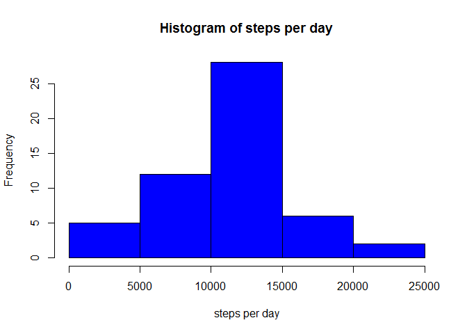
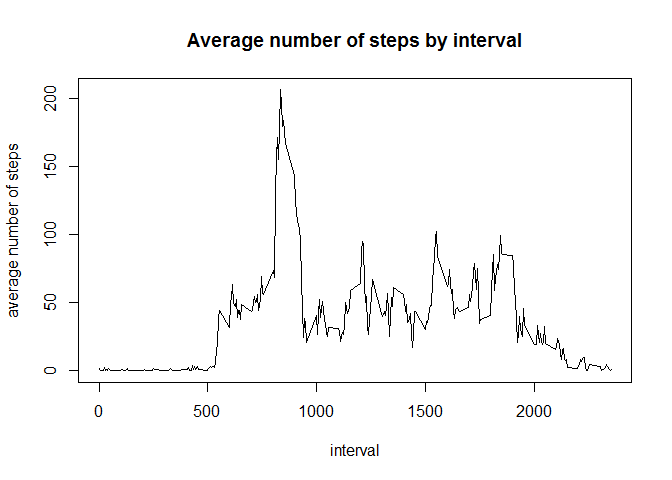
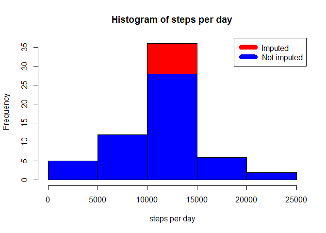
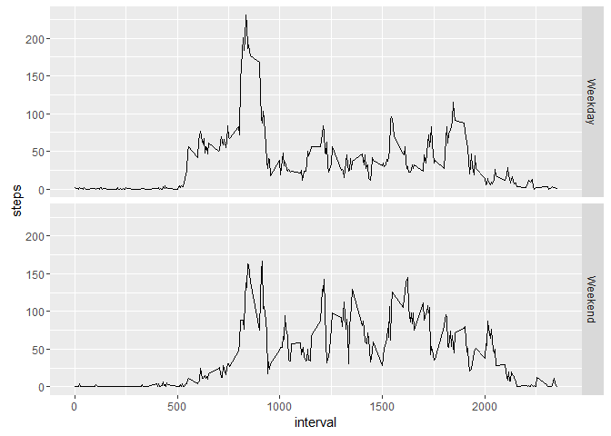

# Reproducible Research: Peer Assessment 1
  
  
## Loading and preprocessing the data
Downloadin, unziping and loading the dataset into the data frame `activity`


```r
download.file("https://d396qusza40orc.cloudfront.net/repdata%2Fdata%2Factivity.zip", destfile = "repdata%2Fdata%2Factivity.zip", method="auto")
unzip(zipfile = "repdata%2Fdata%2Factivity.zip", exdir="./data")
activity <- read.csv("./activity.csv")
```

Showing the first lines of the data set to get an understanding of the data sets structure


```r
head(activity)
```

```
##   steps       date interval
## 1    NA 2012-10-01        0
## 2    NA 2012-10-01        5
## 3    NA 2012-10-01       10
## 4    NA 2012-10-01       15
## 5    NA 2012-10-01       20
## 6    NA 2012-10-01       25
```

Showing summary statistics of the dataset


```r
summary(activity)
```

```
##      steps                date          interval     
##  Min.   :  0.00   2012-10-01:  288   Min.   :   0.0  
##  1st Qu.:  0.00   2012-10-02:  288   1st Qu.: 588.8  
##  Median :  0.00   2012-10-03:  288   Median :1177.5  
##  Mean   : 37.38   2012-10-04:  288   Mean   :1177.5  
##  3rd Qu.: 12.00   2012-10-05:  288   3rd Qu.:1766.2  
##  Max.   :806.00   2012-10-06:  288   Max.   :2355.0  
##  NA's   :2304     (Other)   :15840
```

## What is mean total number of steps taken per day?

Summing the total number of steps per day


```r
steps_per_day <- aggregate(steps ~ date, activity, sum)
```

Calculating the median of steps per day


```r
median(steps_per_day$steps)
```

```
## [1] 10765
```

Calculating the mean of steps per day


```r
mean(steps_per_day$steps)
```

```
## [1] 10766.19
```

Displaying the steps taken per day


```r
hist(steps_per_day$steps, col = "blue", main = "Histogram of steps per day", xlab= "steps per day")
```

<!-- -->

## What is the average daily activity pattern?
Calculate the average number of steps by interval


```r
avg_steps_by_interval <- aggregate(steps ~ interval, activity, mean)
```

Display the average number of steps by interval


```r
plot(avg_steps_by_interval$interval, avg_steps_by_interval$steps, xlab="interval", ylab="average number of steps", main="Average number of steps by interval", type="l")
```

<!-- -->

## Imputing missing values

A simple strategy for imputing missing values suitable for this scenario is to impute missing values with their intervals rounded average number of steps. In this scenario, if the number of steps for the interval 530 is missing, the NA gets replaced by `2`, since the average steps taken during this interval is `2.0943396`.


```r
activity_imputed <- transform(activity, steps = ifelse(is.na(activity$steps), avg_steps_by_interval$steps[match(activity$interval, avg_steps_by_interval$interval)], activity$steps))
```

The following histogram shows that the total number of steps per day is of course higher for the dataset after imputation (red) then before the imputation (blue).


```r
steps_per_day_imputed <- aggregate(steps ~ date, activity_imputed, sum)

hist(steps_per_day_imputed$steps, col = "red", main = "Histogram of steps per day", xlab= "steps per day")
hist(steps_per_day$steps, col = "blue", main = "Histogram of steps per day", xlab= "steps per day", add=T)
legend("topright", c("Imputed","Not imputed"), col=c("red","blue"), lwd="10")
```

<!-- -->

## Are there differences in activity patterns between weekdays and weekends?

To answer this question a factor is created that indicates if a day is a weekday or a weekend day. Afterwards the average steps per interval are calculated for weekends and weekdays.

```r
activity_imputed$daytype <- as.factor(ifelse(strftime(activity_imputed$date,'%u') %in% c(6,7), 'Weekend', 'Weekday'))
avg_steps_by_interval_daytype <- aggregate(steps ~ interval + daytype, activity_imputed, mean)
```

After the data is prepared, the difference between weekdays and weekends is displayed in the following plot.


```r
library(ggplot2)
qplot(interval, steps, data= avg_steps_by_interval_daytype, geom="line", facets=daytype~.)
```

<!-- -->

It shows that there is more overall activity on the weekends. While there is more activity in the morning on weekdays, there is more activity in the evening on weekends.
